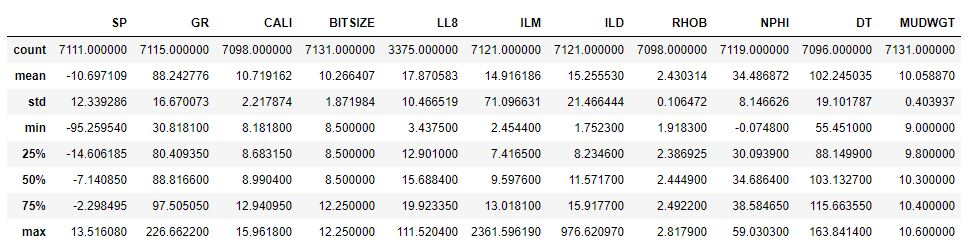

# Application of Data Science to Petrophysical Analysis
## 1) Objectives
The aim of this project is to carry out basic petrophysical analysis on well logs.
## 2) Data Sources
The format of the data utilized for this project is the Log ASCII Standard (LAS) is a standard file-format common in the oil-and-gas and water well industries to store well log information. This file type is formatted as shown below where the `~CURVE INFORMATION` is the column header.

```
~VERSION INFORMATION
VERS.      2.0   :CWLS LOG ASCII STANDARD--VERSION 2.0
WRAP.      NO    :ONE LINE PER DEPTH STEP
~WELL INFORMATION
#MNEM.UNIT              DATA          DESCRIPTION
#================================================
STRT.FT                        101.00000 :START DEPTH
STOP.FT                       3666.00000 :STOP DEPTH
STEP.FT                          0.50000 :STEP
NULL.                         -999.00000 :NULL VALUE
COMP.   Data output from TerraStation II         : COMPANY
WELL.   Walakpa 1                                : WELL NAME
UWI.    50-023-20013                             : WELL UWI
API.    50-023-20013                             : WELL API
LOC.    9 20N 19W                                : WELL LOCATION
DATE.   NorthSlope.W08                           : WELL DATE
FLD.    No Project Selected                      : Project NAME
~CURVE INFORMATION
#================================================
M__DEPTH.FT                  :M__DEPTH
SP      .MV                  :SP
GR      .GAPI                :GR
CALI    .IN                  :CALI
BitSize .IN                  :BitSize
LL8     .OHMM                :LL8
ILM     .OHMM                :ILM
ILD     .OHMM                :ILD
RHOB    .G/CC                :RHOB
NPHI    .%                   :NPHI
DT      .US/F                :DT
MudWgt  .LBS/GAL             :MudWgt
~PARAMETER INFORMATION
#================================================
~OTHER INFORMATION
#================================================
~A
     101.00000    -999.00000    -999.00000    -999.00000      12.25000    -999.00000    -999.00000    -999.00000    -999.00000      -0.07240    -999.00000       9.00000
     101.50000    -999.00000    -999.00000    -999.00000      12.25000    -999.00000    -999.00000    -999.00000    -999.00000      -0.07360    -999.00000       9.00000
     102.00000    -999.00000    -999.00000    -999.00000      12.25000    -999.00000    -999.00000    -999.00000    -999.00000      -0.07480    -999.00000       9.00000
```
Data of this nature is in abundance due to the high volume of oil and gas exploration. In this project, data from the Department of the Interior U.S. Geological Survey repository of Wildcat Wells in the National Petroleum Reserve in Alaska will be used [https://certmapper.cr.usgs.gov/data/PubArchives/OF00-200/WELLS/WELLIDX.HTM]. However, this project is not exclusive to this data, therefore, the workflow and codes could be applied to data from other database.

This well logs are subsurface informations and therefore have associated stratigraphic data, stored as text files. An example of this text file for the LAS file above is:
```

Dept. of the Interior
U.S. Geological Survey
Energy Resources Team

Selected Data from Fourteen Wildcat Wells in 
the National Petroleum Reserve in Alaska

USGS Open File Report 00-200 


Wildcat Well Walakpa 1 - Depths to Selected Stratigraphic Horizons

WELL NAME         ROCK UNIT                                   DEPTH, FEET
WALAKPA 1         Surficial Deposits and/or Gubik Formation      19
WALAKPA 1         Torok Formation                                50
WALAKPA 1         Pebble Shale Unit                            1700
WALAKPA 1         Kingak Shale                                 2090
WALAKPA 1         Sag River Sandstone                          3220
WALAKPA 1         Shublik Formation                            3260
WALAKPA 1         Basement Complex                             3630

Data Source
Table 15.3. - Total depth and depths to selected stratigraphic horizons
for Government-drilled wells on the North Slope of Alaska., 
in:

Gryc, George, Ed., 1988, Geology and exploration of the National Petroleum
     Reserve in Alaska, 1974 to 1982, U.S. Geological Survey Professional 
     Paper 1399, Pgs. 322 - 324.
```
The stratigraphic information is used in the interpretation of the well log data.
## 3) Implementation
The analysis of the well logs will be carried out using Python.

packages: wget, bash, numpy, matplotlib, lasio and pandas

wget package will be used to efficiently download the .LAS and .txt file for this project.
LAS is a file format cannot be used in the python programming language. `lasio` is a package built to solve this problem of analysis of LAS files (documentation can be found here: https://buildmedia.readthedocs.org/media/pdf/lasio/latest/lasio.pdf). The lasio package will be utilized to read the LAS file and convert it into a DataFrame using pandas. The pandas package makes for the easy wrangling and utilization of spreadsheet data (i.e data with rows and columns). matplotlib will be utilize to display the logs.

## 4) Expected Products
### Manipulating the stratigraphic information
The textfile contains information not needed for the petrophysical analysis. a script will be written to automtically wrangle each of the textfile to new textfile with only information required for the analysis. The new textfile will look like this:
```
WELL NAME         ROCK UNIT                                   DEPTH, FEET
WALAKPA 1         Surficial Deposits and/or Gubik Formation      19
WALAKPA 1         Torok Formation                                50
WALAKPA 1         Pebble Shale Unit                            1700
WALAKPA 1         Kingak Shale                                 2090
WALAKPA 1         Sag River Sandstone                          3220
WALAKPA 1         Shublik Formation                            3260
WALAKPA 1         Basement Complex                             3630
```
### Visualization of the data in pandas
As earlier mentioned, the LAS file is in a unique format that python and most programming languages can't read appropriately. However, the lasio package is used to convert the LAS file into a DataFrame that python understands. After series data manipulation, the data which will be used for the analysis will look like below. Compare this with the LAS format above and notice the difference.


### Displaying the logs
To visualize the curves using the triple-combo display format (which is the widely used industry format), matplotlib package will be used.
This triple combo display will be made up of three tracks with some related logs plotted on the same track. The first track will have the Gamma Ray log (GR), Self-Potential log (SP) and Caliper log (CALI), the second track will consist of the various types of Resistivity logs (IL8, ILM, ILD), and the third track will have the Density log (RHOB), Sonic log (DT) and Neutron log (NPHI).On this log, the stratigraphic interval will be plotted at the corresponding depth and labelled accordingly.


### Basic Statistical Analysis
The data will be analysed using some basic statistical techniques and the result will be displayed as shown below:


### Calculating Volume of Shale
The volume of shale (Vshale) is expressed as a decimal fraction or percentage. It is usually the first step of well log analysis. There are several methods of calculating Vshale. In this project, the GR and SP methods will be used.

Calculation of the gamma ray index is the first step needed to determine the volume of shale from GR log. `IGR=(GR_log-GR_min)/(GR_max-GR_min)`
The Vshale is then computed using the Larionov (1969), Clavier (1971) and Steiber (1969) non-linear relationships.
   
```
    Vshale_larionov_young=0.083*(2**(3.7*IGR)-1)   #Larionov (1969) - Tertiary rocks
    
    Vshale_larionov_old=0.33*(2**(2*IGR)-1)        #Larionov (1969) - Older rocks
    
    Vshale_clavier=1.7-(3.38-(IGR+0.7)**2)**0.5    #Clavier (1971)
    
    Vshale_steiber=IGR/(3-(2*IGR))                 #Steiber (1969)
```
Using the SP log, the Vshale will be computed using this relationship `Vshale_sp=(SP_log-SP_clean)/(SP_clay-SP_clean)`
The expected result of this computation is to be appended to the data creating new columns called __Vshale__ and the curves for all the returned Vshale methods will be plotted on the same track for comparison.
 
### Estimating Porosity
Porosity is a very important parameter when it comes to reservoir characetrization. There are several ways of estimating porosity from well logs. In this project, the Neutron-Density method will be utilized.
Density porosity is estimated by using `PHID = (RHOB - DENSma) / (DENSw - DENSma)` and the NPHI is the Neutron porosity.
The Neutron-Density Porosity is then estimated using the relationship below:
```
PHIND= (PHID + NPHI) / 2      #for interval without gas
PHIND= ((PHID**2+NPHI**2)/2)**(0.5)   #for interval with gas as seen from crossover
```
The result of this step is appended to the data as a new column called PHIND

### Calculating Water Saturation
Water Saturation (SW) will be calculated by using the Archie equation.
```
SW**n = (a * RW) / (RT * PHIND**m)
Where: a is the turtuosity factor
       m is the cementation factor
       n is the saturation exponent
```
The result of the calculated water saturation will be validated using a pickett plot which is a crossplot of resistivity and porosity. An example of this plot is shown below:

